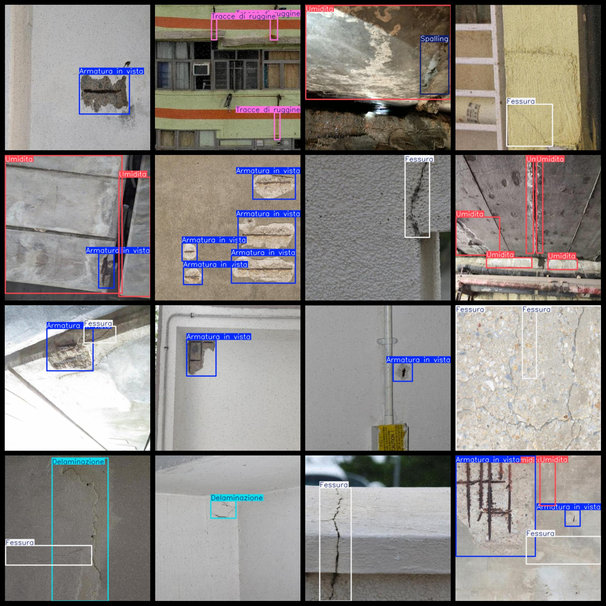
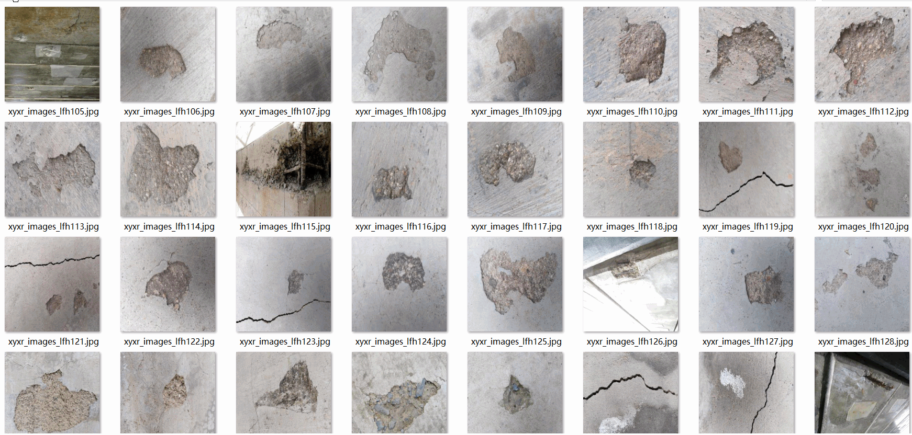

# Building Detection Dataset for Outer Wall Surface Defects: 5737 Images in VOC+YOLO Format

The dataset format is Pascal VOC format plus YOLO format (excluding the splitting path's txt file, only including jpg images as well as their corresponding VOC format xml files and YOLO format txt files).

Number of images (jpg file count): 5737

Number of annotations (xml file count): 5737

Number of annotations (txt file count): 5737

Number of annotation categories: 7

Repository location: datasets_sl

Annotation category names according to the order in the yolo format (note that the order in the labels folder's classes.txt doesn't match this): ["Armatura in vista", "Delaminazione", "Fessura", "Scaling", "Spalling", "Tracce di ruggine", "Umidita"]

Chinese label translation: "Visible reinforcement bars", "Layering", "Crack", "Rip", "Loosening", "Rust", "Moisture"

Box counts for each category:

Armatura in vista box count = 3673

Delaminazione box count = 1005

Fessura box count = 4513

Scaling box count = 240

Spalling box count = 2004

Tracce di ruggine box count = 2550

Umidita box count = 1748

Total box count: 15733

Number of images per category:

Armatura in vista image count = 2186

Delaminazione image count = 746

Fessura image count = 2509

Scaling image count = 160

Spalling image count = 1218

Tracce di ruggine image count = 978

Umidita image count = 903

Image resolution: 416x416

Annotation tool used: labelImg

Dataset enhancement status: Yes

Annotation rules: Draw a bounding box around the category

Important note: The dataset does not have been divided into training validation test sets; you need to do so yourself.

Special declaration: This dataset does not guarantee the accuracy of the models trained or weight files.

## Images

---

Here is a pay link on Stripe (https://buy.stripe.com/3cs8yP7sY87d0vu9AB). Please contact me lonlonago@foxmail.com after funding $89, and I will send you a complete data files, thank you!

